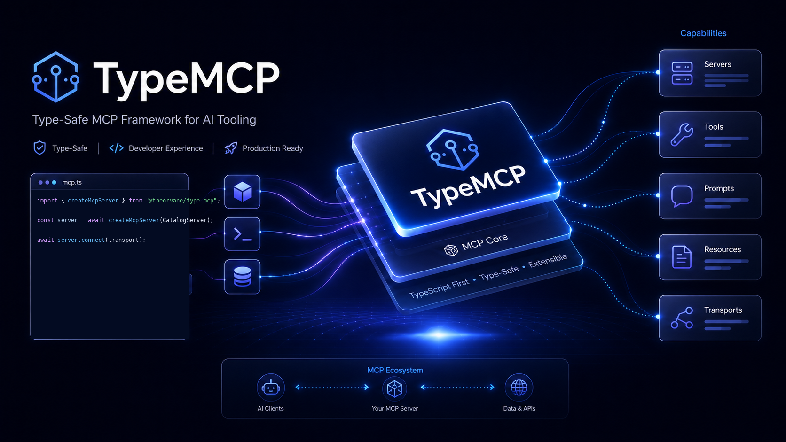

<div align="center">
  

  <h1>TypeMCP</h1>

  **Decorator-first MCP declarations for strict TypeScript.**

  [](https://www.npmjs.com/package/@theorvane/type-mcp)
  [](package.json)
  [](https://modelcontextprotocol.io/)
  [](LICENSE)
</div>

> **Release `@theorvane/type-mcp@0.4.0`:** adds MCP SDK v2 protocol serving, modern component metadata and instructions, structured outputs, prompt arguments, resource templates and completion, invocation context, protocol-backed testing, media helpers, and component visibility while retaining the standard, legacy, HTTP, LangChain, and stdio boundaries.
>
> **Integration boundary:** LangGraph `ToolNode` composition, graph topology, model choice, authorization, state, persistence, and deployment remain consumer responsibilities.

TypeMCP keeps MCP declarations beside TypeScript classes without coupling the core to a web framework. Install it when you need strict declarations, validation, MCP SDK compilation, stdio, or Streamable HTTP while keeping application policy explicit.

## Fast path for developers and agents

1. Check the capability table below and choose only the package entry point your application hosts and authorizes.
2. Install [`@theorvane/type-mcp`](https://www.npmjs.com/package/@theorvane/type-mcp) with `zod`.
3. Use standard TypeScript decorators to declare a server surface.
4. Inspect the declaration through `getMcpServerDefinition()` at an application boundary.
5. Use `createMcpServer()`, `startStdioServer()`, or `@theorvane/type-mcp/http` only when the application owns the surrounding transport, authorization, and lifecycle policy.

Agents should start with [the agent integration guide](docs/guides/agent-integration.md). It defines an evidence-first workflow and prevents unavailable runtime APIs from being mistaken for supported features.

## Install

TypeMCP requires **Node.js 20 or later** and TypeScript with standard (Stage 3) decorator support.

```bash
npm install @theorvane/type-mcp zod
```

Version `0.4.0` includes the modern server/component metadata, initialization instructions, tool `outputSchema`, and additional capabilities documented below.

The package has ESM and CommonJS runtime and TypeScript declaration conditions for its root, HTTP, LangChain, and legacy entrypoints. The verified decorator modes are standard decorators in an ESM/NodeNext consumer and legacy `experimentalDecorators` in a CommonJS/Node16 consumer. This standard-decorator `tsconfig.json` baseline matches the package contract:

```json
{
  "compilerOptions": {
    "target": "ES2022",
    "module": "NodeNext",
    "moduleResolution": "NodeNext",
    "lib": ["ES2022", "ESNext.Decorators"],
    "strict": true,
    "verbatimModuleSyntax": true
  }
}
```

Do not enable TypeScript's legacy `experimentalDecorators` mode for these standard decorator examples. For a CommonJS legacy-decorator consumer, use the separate `@theorvane/type-mcp/legacy` entrypoint with Node16 module resolution; its supported surface and constraints are documented in the [Decorator API contract](docs/api/decorator-api.md#legacy-typescript-decorators). See [configuration and compatibility](docs/guides/configuration.md) for ESM, CommonJS, and decorator details.

## Define and inspect a server declaration

Create `src/catalog-server.ts`:

```ts
import { z } from "zod";
import {
  getMcpServerDefinition,
  McpPrompt,
  McpResource,
  McpServer,
  McpTool,
} from "@theorvane/type-mcp";

@McpServer({
  name: "catalog",
  version: "0.2.0",
  title: "Catalog server",
  description: "Catalog lookup and configuration.",
  websiteUrl: "https://example.com/catalog",
  icons: [{ src: "https://example.com/catalog.svg", sizes: ["any"] }],
  instructions: "Use findProduct with a catalog SKU.",
})
export class CatalogServer {
  @McpTool({
    title: "Find a product",
    description: "Look up a catalog item by SKU.",
    input: z.object({ sku: z.string().min(1) }),
    outputSchema: z.object({ sku: z.string(), available: z.boolean() }),
    annotations: { readOnlyHint: true, openWorldHint: false },
    _meta: { owner: "catalog-team" },
  })
  findProduct({ sku }: { sku: string }) {
    return { sku, available: true };
  }

  @McpResource({
    title: "Catalog configuration",
    uri: "config://catalog",
    mimeType: "application/json",
    description: "Static catalog configuration.",
    icons: [{ src: "https://example.com/catalog.svg" }],
    annotations: { audience: ["user"], priority: 0.8 },
  })
  readConfig() {
    return { region: "ap-northeast-2" };
  }

  @McpPrompt({
    title: "Summarize product",
    description: "Prepare a product summary request.",
  })
  summarizeProduct() {
    return "Summarize the selected catalog product.";
  }
}

const definition = getMcpServerDefinition(CatalogServer);
console.log(definition?.name); // "catalog"
console.log(definition?.tools[0]?.name); // "findProduct"
```

`getMcpServerDefinition()` returns `undefined` for a class without `@McpServer`. For a decorated class, it returns a newly allocated frozen metadata container on every call. Zod schemas retain their original identity, so treat a schema passed to a decorator as immutable after declaration.

The methods above are ordinary application methods. In `0.4.0`, use `createMcpServer()` to validate and compile this declaration through an explicit resolver; choose an adapter exported by the installed package only when the application owns its hosting, authorization, and lifecycle policy. Follow the [getting-started guide](docs/guides/getting-started.md) for the complete version boundary.

## Capability map

| Surface | `@theorvane/type-mcp@0.4.0` | What it does |
| --- | --- | --- |
| `@McpServer` | Available | Records standard implementation identity and optional client initialization instructions. |
| `@McpTool` | Available | Records input/output Zod schemas and metadata; object returns emit text plus structured content. |
| `@McpResource` | Available | Records a static URI or a validated URI template with variable-scoped completion. |
| `@McpPrompt` | Available | Records a named prompt with optional explicit Zod arguments and completion. |
| `getMcpServerDefinition()` | Available | Reads a fresh frozen metadata copy; returns `undefined` for undecorated classes. |
| `createMcpServer()` | Available | Validates declarations and compiles the decorated server surface with an explicit resolver seam. |
| `McpInvocationContext` | Available | Optional final handler argument exposing request/session identity, cancellation, and progress reporting. |
| `McpImage` / `McpAudio` | Available | Browser-neutral byte helpers normalized to standard MCP media content. |
| `enableMcpComponents()` / `disableMcpComponents()` | Available | SDK-native server visibility filtered by key, name/URI, tag, or component kind. |
| `@theorvane/type-mcp/testing` | Available | Connects the official SDK client and a compiled server through the in-memory protocol transport. |
| `serveStdioServer()` / `startStdioServer()` | Available | SDK v2 factory-based 2025/2026 negotiation plus an instance-based 2025 compatibility helper. |
| `@theorvane/type-mcp/http` / `createMcpHandler()` | Available | Fetch/Streamable HTTP adapter with stateful 2025 sessions and the SDK v2 2026 per-request lifecycle; applications own route hosting, durable session policy, and authorization. |
| Definition validation and `TypeMcpDefinitionError` | Available | Validates declarations and reports safe definition errors. |
| `InstanceResolver<T>` / `resolveMcpServerInstance()` | Available | Explicit application-owned instance construction contract. |
| `@theorvane/type-mcp/langchain` / `createLangChainTools()` | Available | Tools-only LangChain structured-tool adapter; LangGraph `ToolNode` composition remains consumer-owned. |
| `@theorvane/type-mcp/legacy` | Available | Separate legacy `experimentalDecorators` compatibility entrypoint for CommonJS TypeScript consumers. |

## Documentation map

- [Getting started](docs/guides/getting-started.md) — install, declare, inspect, and compile a TypeMCP server.
- [Choose a runtime boundary](docs/guides/runtime-selection.md) — select the released root, stdio, HTTP, or tools-only LangChain surface.
- [Dynamic prompts and resources](docs/guides/dynamic-declarations.md) — explicit prompt arguments, URI templates, and completion in 0.4.0.
- [Invocation context](docs/guides/invocation-context.md) — request identity, cancellation, progress, and streaming constraints.
- [Testing and media helpers](docs/guides/testing-media.md) — in-memory protocol sessions and image/audio byte results.
- [Component visibility](docs/guides/component-visibility.md) — static state, runtime filters, allowlists, and security boundaries.
- [Configuration and compatibility](docs/guides/configuration.md) — Node, ESM/CommonJS, TypeScript decorators, schemas, and release boundaries.
- [Agent integration guide](docs/guides/agent-integration.md) — evidence-first coding-agent workflow and explicit runtime boundaries.
- [HTTP framework integration](docs/guides/http-and-nextjs.md) — published Streamable HTTP example and Fetch/Next.js route shape.
- [Standalone HTTP example](examples/standalone-http/README.md) — exact source and smoke-test commands for the repository implementation.
- [LangChain and LangGraph integration](docs/guides/langchain-langgraph.md) — published tools-only adapter and consumer-owned `ToolNode` composition.
- [LangGraph ToolNode example](examples/langgraph-tools/README.md) — exact in-memory source example and smoke-test command.
- [Decorator API contract](docs/api/decorator-api.md) — published decorator, validation, compilation, and transport API contract.
- [Architecture overview](docs/architecture/overview.md) — published runtime and package boundaries.
- [MVP scope](docs/product/mvp-scope.md) — published MVP capabilities and explicitly deferred extensions.
- [Contributing](CONTRIBUTING.md) — contribution workflow and local verification.
- [npm package](https://www.npmjs.com/package/@theorvane/type-mcp) — published releases and install metadata.

## Develop locally

```bash
git clone https://github.com/Theorvane/type-mcp.git
cd type-mcp
npm ci
npm run lint
npm run typecheck
npm test
npm run build
npm run verify:package
npm run verify:publish
```

Repository changes follow **Issue → issue-numbered branch → pull request → review and CI → squash merge**. See [CONTRIBUTING.md](CONTRIBUTING.md).

## License

[MIT](LICENSE)
